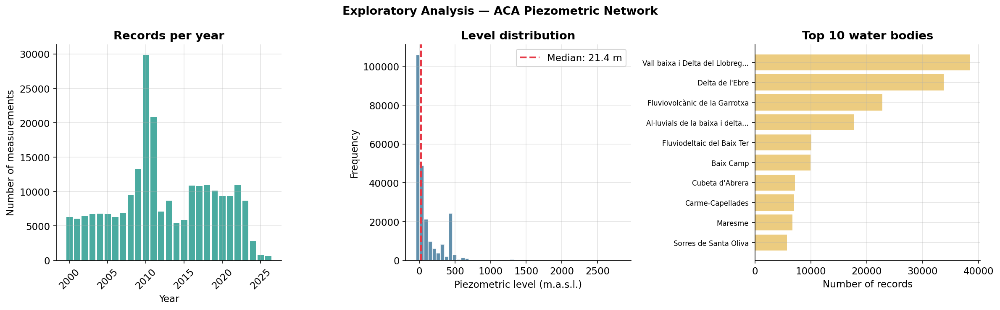
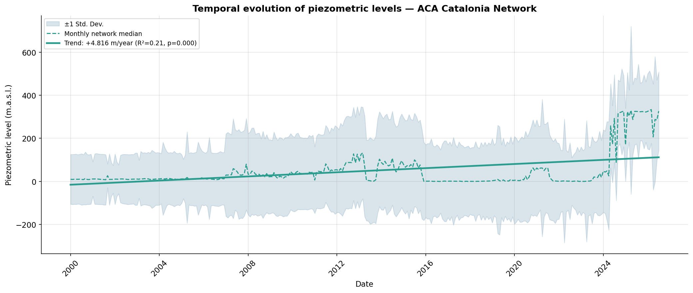
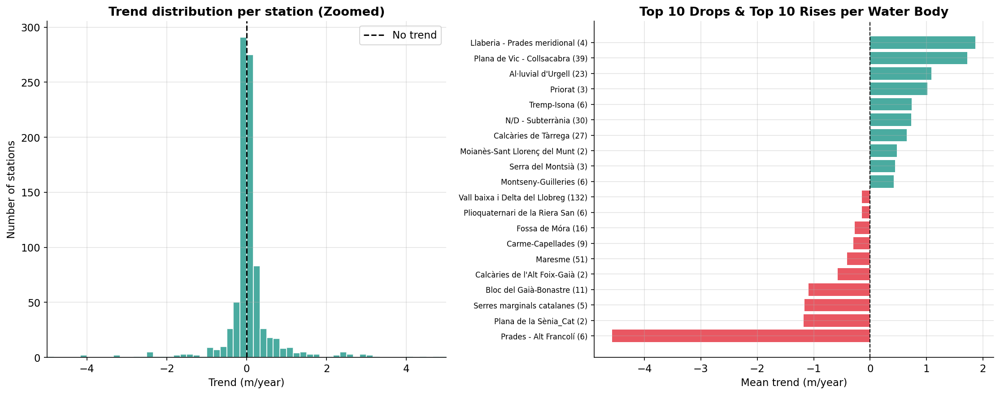
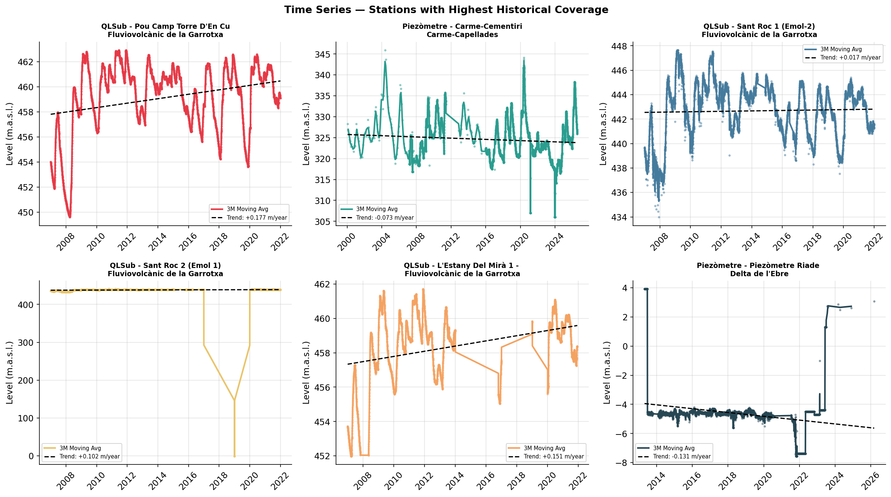
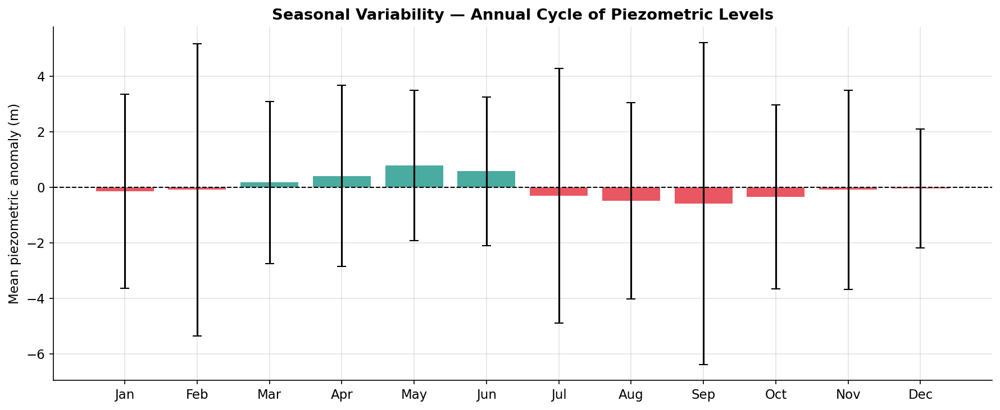

# Piezometric Network of Catalonia — Groundwater Analysis

> **ACA Open Data · Time Series · Piezometric Trends · Folium Interactive Map**  
> Independent analysis using public data from the Catalan Water Agency (ACA)

---

## Project Description

This project analyzes **groundwater piezometric levels in Catalonia** using open data from the monitoring network of the Catalan Water Agency (ACA). The dataset is updated daily and contains historical measurements from dozens of piezometers distributed across the groundwater bodies of Catalonia's internal basins.

Given that monitoring and safeguarding groundwater is vital to evaluate the impact of droughts, detect aquifer overexploitation, and plan sustainable extractions, this project automates the extraction and processing of historical data directly from ACA's public open data API.

The comprehensive analysis includes:

1. **Automated API Download** — Direct retrieval of historical piezometric records from the ACA portal.
2. **Data Cleansing & Validation** — Automated filtering of spatial coordinates, logical physical ranges, and temporal continuity across the network.
3. **Exploratory & Temporal Trend Analysis** — Linear regression models applied to individual stations and overall network aggregations to quantify rise/drop rates.
4. **Seasonal Variability Assessment** — Identification of annual anomalies and cyclical intra-annual patterns driven by irrigation and climatic cycles.
5. **Interactive Spatial Mapping** — Clustered and layered Folium web map categorizing stations by trend intensity and water body classification.

---

## Data Source

| Field | Detail |
|-------|---------|
| **Publisher** | Agència Catalana de l'Aigua (ACA) — Generalitat de Catalunya |
| **Dataset** | Nivell piezomètric de les aigües subterrànies de Catalunya |
| **Update Frequency** | Daily |
| **License** | Open Data Generalitat de Catalunya (CC BY 4.0) |
| **Direct URL** | `https://analisi.transparenciacatalunya.cat/api/views/6899-hrme/rows.csv` |

The data includes: station description, water body name, UTM coordinates, well depth, and piezometric level (meters above sea level).

---

## Main Results

| Parameter / Metric | Value |
|--------------------|-------|
| Total Raw Records | 243,969 |
| Valid Cleaned Records | 238,186 |
| Total Piezometers Analyzed | 907 |
| Network Median Level | 21.40 m a.s.l. |
| Overall Annual Trend (Aggregate) | +4.816 m/year |
| Stations with Negative Trend (Drop) | 426 (47.0%) |
| Stations with Positive Trend (Rise) | 481 (53.0%) |

---

## Data Visualizations


*Exploratory distribution of records, level frequencies, and top water bodies*


*Temporal evolution and linear regression trend of the network*


*Distribution of individual station trends and extreme water bodies*


*Time series and moving averages for stations with highest historical coverage*


*Annual cycle and monthly piezometric anomalies*

🌐 **Interactive Map:** You can view the interactive clustered map live here: [Open Interactive Map](https://cdmunozs.github.io/ACA-Piezometry-Catalunya/output/mapa_piezometrico_catalunya.html)

The analysis generates an interactive HTML map (`output/mapa_piezometrico_catalunya.html`) that allows you to:

- View the location of all ACA network piezometers
- Check the individual trend of each station (m/year)
- Filter and toggle layers between positive and negative trends independently using grouped clusters
- View full details by clicking on each point

**Color Legend:**
- 🔴 Severe Drop (< −0.5 m/year)
- 🟠 Moderate Drop (−0.5 to −0.1 m/year)
- 🟡 Stable (−0.1 to +0.1 m/year)
- 🟢 Moderate Rise (+0.1 to +0.5 m/year)
- 🔵 Significant Rise (> +0.5 m/year)

---

## Repository Structure
```
ACA-Piezometry-Catalunya/
│
├── data/
│   └── (Auto-downloaded from ACA API)
├── output/
│   ├── 01_exploratorio.png
│   ├── 02_tendencia_general.png
│   ├── 03_distribucion_tendencias.png
│   ├── 04_series_temporales.png
│   ├── 05_estacionalidad.png
│   ├── mapa_piezometrico_catalunya.html
│   └── resumen_tendencias_estaciones.csv
├── piezometria_aca_catalunya.ipynb
└── README.md
```
---

## How to Run the Analysis

```bash
pip install pandas numpy matplotlib scipy folium pyproj
jupyter notebook piezometria_aca_catalunya.ipynb
```

---

## Tech Stack


---

## Hydrogeological Context

Catalonia's groundwater monitoring network distributed across internal basins records piezometric levels in numerous wells embedded in diverse hydrogeological units. While regional aggregate trends can show mathematical balances influenced by artificial recharge or specific heavy recoveries, individual station breakdowns reveal that nearly half of the monitored points (47.0%) face severe negative trends. This high polarization underscores the vulnerability of local aquifers to intense anthropogenic extractions and multi-annual drought sequences established by the Catalan Drought Plan.

---

## Authors

**Carlos Daniel Muñoz Sánchez**  
- Geologist · Hydrogeologist · GIS & Data Analyst 
- M.Sc. Science and Integrated Water Management — Universitat de Barcelona  
[LinkedIn](https://www.linkedin.com/in/danielmu95/) · [GitHub](https://github.com/cdmunozs)

---

## References

- Agència Catalana de l'Aigua (ACA). (2024). Nivell piezomètric de les aigües subterrànies de Catalunya. Generalitat de Catalunya — Open Data.
- Agència Catalana de l'Aigua (ACA). (2020). Pla especial d'actuació en situació d'alerta i eventual sequera (PES). Generalitat de Catalunya.
